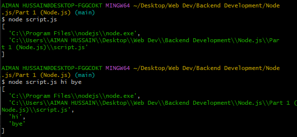

References:
* https://www.freecodecamp.org/news/what-are-node-modules/
* https://www.codecademy.com/learn/learn-node-js/modules/intro-to-node-js/cheatsheet

Node.js is a Javascript Runtime Environment. Used for server side programming. Not a language, library or framework.

Node REPL (Read, Evaluate, Print and Loop) is a console window or a programming language environment. Opens in powershell and git bash by command "node". Node.js already uses REPL.

Window Object (in browser/doesn't work in node) --> Global Object (in Node.js)

# Executing JS files with the help of Node.js
If one wants to run Javascript files from node.js, it should be mandatory that one has to be in the correct directory(i.e., whichever folder contains the file to be executed) 

# Process 
This object provides information about, and control over the current Node.js process.

# process.argv
process.argv is a property that holds an array of command-line values provided when the current process was initiated. The first element in the array is the absolute path to the Node, followed by the path to the file that's running and finally any command-line arguments provided when the process was initiated.
 - here script.js has only one line of code i.e. : " console.log(process.argv) "
If we intend for our code to use certain values inputed by user, we use process.argv (similar to prompt in browser environment)

# Export in files : Using functions of one file in another (given in same directories)
In programming, modules are components of a program with one or more functions or values.

module.exports - is an special object in a Node.js file that holds the exported values and functions from that module. Declaring a module.exports object in a file specifies the values to be exported from that file. When exported, another module can import this values with the require global method.

require() method - a built in function to include external modules that exist in separate files. Syntax for importing files : require("./filename") ["./" --> means accessing a file/directory]

If a file in JS doesn't export anything and in another file if a module tries to import from the former file using require method - in such a case empty object ("{}") is printed. 

Three ways of writing module.exports:

1. let obj = {a: 1, b: 2}
module.exports = obj

2. module.exports = {a: 1, b: 2}

3. module.exports.a = 1;
module.exports.b = 2 
Shortform for this method - exports.a = 1; exports.b = 2 (but be careful "exports" alone will be treated as a variable i.e., exports = 1, and not as module.exports. Exports is treated as module.exports when it is treated as an object and function and properties are added to it.)

# Export in directories : Using functions of one file in another (given in different directories)
1. Choose the directory you wish to export from. 
2. Create module.exports in each file of this directory you wish the data(module) to export from. 
3. Create a special file (index.js - the entry point in require method) in the same directory where data from all the other files in it is imported using require(). Combine this required data in an array. Export this array using module.exports.
4. In another directory, locate the file you wish to import data(module) from the previous directory using syntax : require("./directoryname")

# NPM (Node Package Manager)
npm is the standard package manager for Node.js . Package is the code written by someone else which we can use.

Two main characteristics of NPM
1. NPM is a library from where packages can be installed (library of packages - not actually though but can be imagined as one)
2. NPM is a command line tool (via which we can install packages using command line)

# Installing Packages 
Choose then enter a specific file/directory to install a certain package using command "npm install <-package name->". This specific directory matters because the installed package's scope is limited to this directory only for use. This practice is known as local installation. Local installation of packages is the best practice.
On executing the above command, three new files are created in the directory
1. node_modules : the node_modules folder contains every installed dependency for your project. Automatically installed with packages. 
2. package-lock.json : it records the exact version of every installed dependency, including its sub-dependencies and their versions.
3. package.json : this file contains descriptive and functional metadata about a project, such as a name, version and dependencies. Whenever we wish to share pur code with anyone or to push it to Github, we share/push only package.json file (never node_modules folder)
If for some reason node_modules folder is deleted or not there as long as we have package.json file we can simply create node_modules folder by using command "npm install" 

To use a installed package's module, create a file(index.js) in the same directory as before and use package's instructions given on their npm page to use them in this file.

If we want to create package.json for any directory, we use command "npm init" (this means with the help of npm we are initiliazing a package.json for any project of ours.) Use "npm install <-package name->" afterwards to install a package and save it as a dependency in the package.json file.

To install packages not bound to certain directories scope wise, we install them globally using command "npm install -g <-package name->". Now if we run JS file, we will still get error as we are not able to access pacakge yet. To access/use any package after globally installing it we have to link it too using command "npm link <-package name->". Now if we run JS file it will execute without any error.

# require vs import
Reference - https://www.scaler.com/topics/nodejs/require-vs-import-nodejs/
Note: in entire project, either we just use "require" or just "import. Never both together as they belong to different module systems. 
In order to import anything, we first have to export. Export in ES6 module system will be done by 
1. adding "export" keyword infront of any function or variable and all these values will be exported individually (instead of being exported as an object done in CommonJS module system). 
2. Import data into the desired file using commands as given  
// Importing the entire module
import * as name from 'module_name'

// Importing the default export from the module
import name from 'module_name'

// Importing a single export from the module:
import { name } from 'module_name'

// Importing multiple exports from the module:
import { name1, name2 } from 'module_name'.

3. As at present Node.js doesn’t support ES6 import directly. So if we try to use the import keyword for importing modules directly in node js it will throw out the error. To use import for including modules we opt for the method where we just need to include a package.json file in the directory in which we wish to import and export data. And the content of package.json should include a "type" property whose value is set to "module".
 The "type" property present in the above package.json file helps in deciding the module system that the project should use. The "type" can be "module" or "commonjs". If the type is "module" then it enables the ECMAScript module system, whereas if the type is "commonjs" then it is of the CommonJS module system.

# Comparison between require and import
1. Loading is synchronous in require (i.e., modules are imported sequentially.)	Loading is asynchronous in import (i.e., modules are imported without waiting for previous module import to complete.). Because the Asynchronous loading performance of import is better than required.

2. If we import a module using require then the complete module is imported. So, memory usage is more.	Using import we can selectively load pieces of code in the module. So, memory usage is less compared to require.

# Importing a package
1. Use command "npm install <-package name->". 
2. Check for package.json file and in it for - "type":"module".
3. Use instructions from package's npm page to further use imported data. 